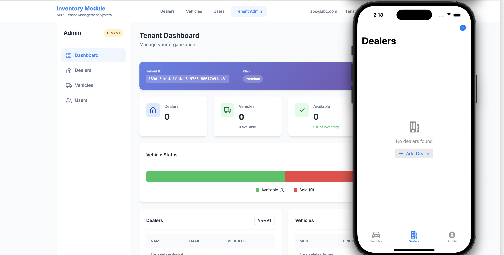

# Inventory Management System

A full-stack multi-tenant inventory management system with Spring Boot backend and mobile apps (iOS, Android, Flutter, React Native).

## Project Structure

```
springboot/
├── inventory-module/
│   ├── backend/           # Spring Boot API
│   ├── frontend/         # Angular web app
│   ├── ios-app/         # iOS SwiftUI
│   ├── android-app/     # Android Native
│   ├── flutter-app/     # Flutter
│   └── rn-app/         # React Native
```

## Screens



## Features

- **Multi-tenant** architecture with X-Tenant-Id header
- **Role-based** access (TENANT_ADMIN, GLOBAL_ADMIN, STANDARD)
- **Full CRUD** for Vehicles, Dealers, Tenants
- **Secure** token storage (Keychain on iOS/Android)
- **Dashboard** with metrics

## Tech Stack

| Platform | Framework/Framework |
|----------|-------------------|
| Backend  | Spring Boot 3.x   |
| iOS      | SwiftUI           |
| Android | Java Native      |
| Flutter | Flutter 3.x     |
| React Native | Expo        |
| Web     | Angular 17       |

## Getting Started

### Backend

```bash
cd inventory-module/backend
mvn spring-boot:run
```

### iOS

```bash
cd inventory-module/ios-app
xcodebuild -project InventoryApp.xcodeproj -scheme InventoryApp -configuration Debug -destination 'platform=iOS Simulator,name=iPhone 16 Pro' build
```

### Test Credentials

- Email: `abc@abc.com`
- Password: `Password123`

## API Endpoints

| Method | Endpoint | Description |
|--------|----------|------------|
| POST | /api/auth/login | Login |
| GET | /vehicles | List vehicles |
| POST | /vehicles | Create vehicle |
| GET | /dealers | List dealers |
| GET | /api/tenants | List tenants |

## Tenant Header

All protected endpoints require `X-Tenant-Id` header.

## License

MIT